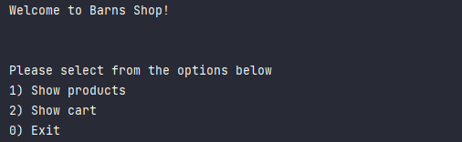

# OnlineStore

This console application allow user to shop online for available product from inventory. User have the ability to
select Show Products. 
    -When selecting a product they can add the product to the cart. 
    -User can choose to continue adding products to their cart otherwise use can return to home screen. 

Once user are ready to check out their product is display and the total amounts. They can either checkout or return
to home screen.
    -If they enter 'checkout' this will allow user to enter the amount due. If amount is insufficient it will state
    'Not enough for total payment. Please enter a larger'.
    -If enter sufficient amount then user will receive their recipe of their purchase.

# Home Screen

